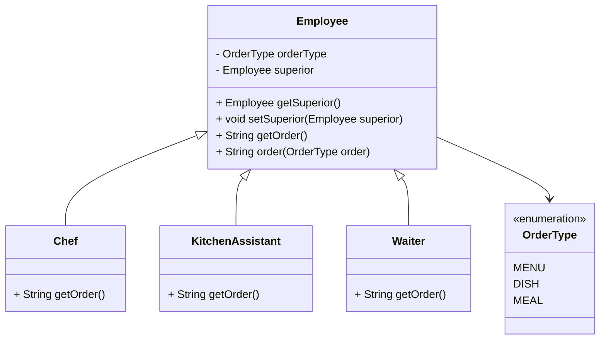

```mermaid
classDiagram
    class Employee {
        - OrderType orderType
        - Employee superior
        + Employee getSuperior()
        + void setSuperior(Employee superior)
        + String getOrder()
        + String order(OrderType order)
    }

    class Chef {
        + String getOrder()
    }

    class KitchenAssistant {
        + String getOrder()
    }

    class Waiter {
        + String getOrder()
    }

    class OrderType {
        <<enumeration>>
        MENU
        DISH
        MEAL
    }

    Employee <|-- Chef
    Employee <|-- KitchenAssistant
    Employee <|-- Waiter
    Employee --> OrderType

```