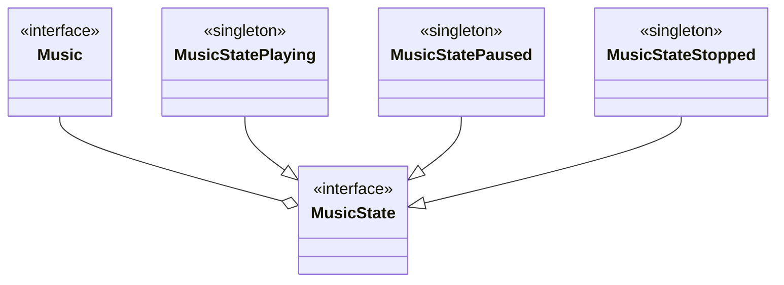

```mermaid
classDiagram
    class Music {
        <<interface>>
    }

    class MusicState {
        <<interface>>
    }

    class MusicStatePlaying {
        <<singleton>>
    }

    class MusicStatePaused {
        <<singleton>>
    }

    class MusicStateStopped {
        <<singleton>>
    }

    Music --o MusicState
    MusicStatePlaying --|> MusicState
    MusicStatePaused --|> MusicState
    MusicStateStopped --|> MusicState

```