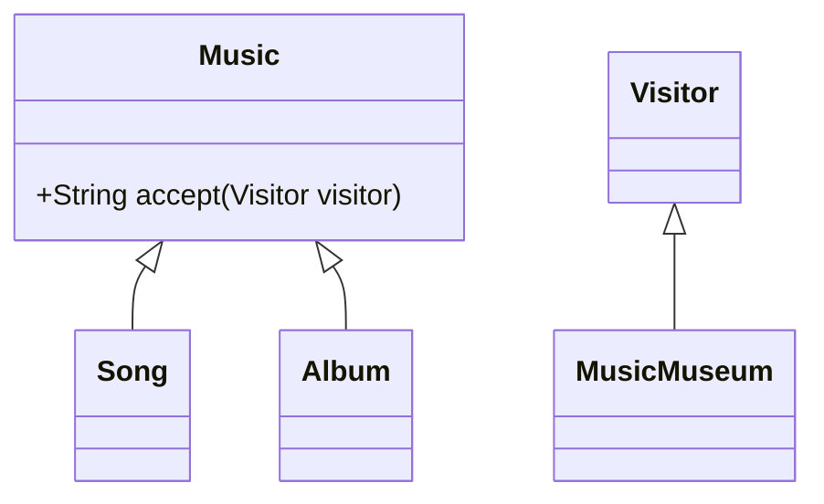

```mermaid
classDiagram
class Music {
+String accept(Visitor visitor)
}

    class Song {
    }

    class Album {
    }

    class MusicMuseum {
    }

    class Visitor {
    }

    Music <|-- Song
    Music <|-- Album
    Visitor <|-- MusicMuseum
```